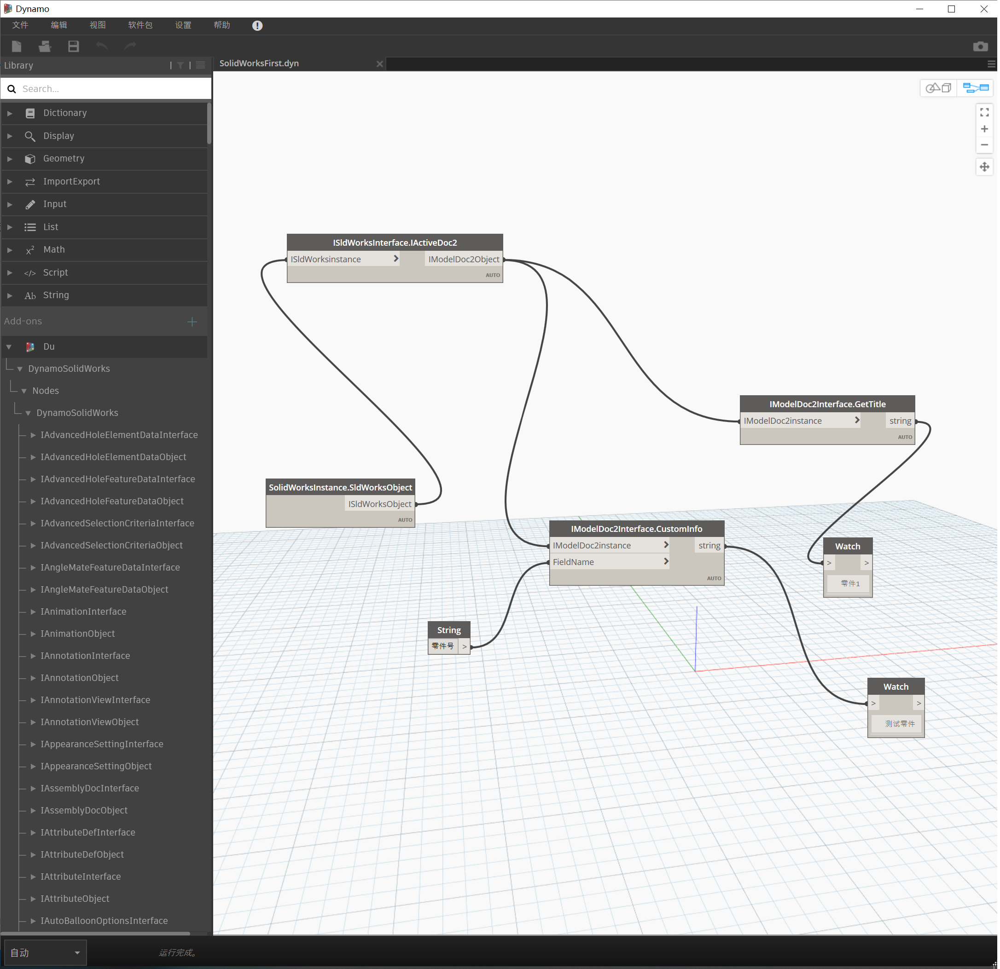

# Dynamo for SolidWorks -- Building

一个嵌入了Dynamo的SolidWorks插件，使SolidWorks也具有可视化编程的功能。

    
    
    

## 接口

&emsp;&emsp;使用反射封装了大部分的SolidWorks api为C#的静态方法以便Dynamo加载调用。详细列表插件SolidWorks api，部分方法列表如下：

    <image src="resources/MethodsOne.png" width="200"/>
    <image src="resources/MethodsTwo.png" width="200"/>
    <image src="resources/MethodsThree.png" width="200"/>

## 发布

&emsp;&emsp;现在只封装了SolidWorks接口，具体业务功能还未实现。未有打包发布版

## Next

* 使用Dynamo变为进程内引用。
* 添加具有SolidWorks 对象选择的功能。
* 解决helix toolkit的问题。
* 添加SolidWorks宏特征，使Dynamo的节点节点文件可以保存在SolidWorks文件中。使SolidWorks具有iLogic类似功能。