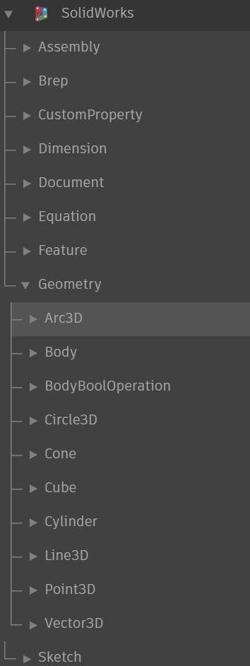

# Dynamo Addin for SolidWorks -- Building

This repos contain the src file for DynamoSldWorks,that connects Dynamo with SolidWorks.

# Download

[Release](https://github.com/weianweigan/DynamoSolidWorks/releases)

Then check your addin startup state.

# Build

1. For some reason,you need build Dynamo core.
2. Copy it to DynamoRuntime folder.
3. Run bat file or copy to bin/Debug.
4. Build the Sultion.

# Nodes

You can take a look at this [file](https://github.com/weianweigan/DynamoSolidWorks/blob/dev/DynamoSldWorks/Resources/LayoutSpecs.json).

# Samples

[Samples](https://github.com/weianweigan/DynamoSolidWorks/tree/dev/DynamoSldWorks/samples)

# License

[License](https://github.com/weianweigan/DynamoSolidWorks/blob/dev/LICENSE)